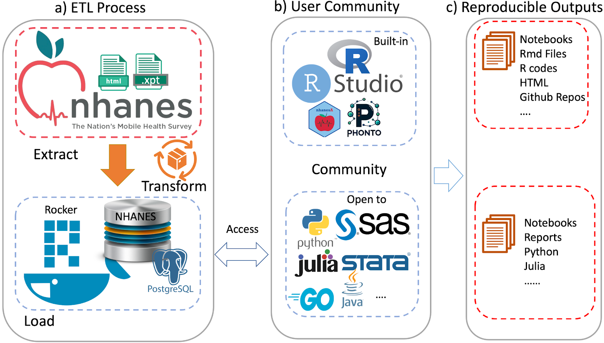

```{r, include=FALSE, eval=FALSE}
##turn this on if you get Latex errors
options(tinytex.verbose = TRUE)
```


```{r setup, results='hide', echo=FALSE, message = FALSE}
library(kableExtra)
library(dplyr)
library(survey)
library(nhanesA)
library(phonto)
stopifnot(isTRUE(nhanesOptions("use.db")))
demo_all <- nhanesSearchTableNames("DEMO")
all_demo_data <- sapply(demo_all, nhanes, simplify = FALSE)
object.size(all_demo_data) # ~45 MB
## sapply(all_demo_data, dim)
```


# Introduction

Accessible large complex survey data such as that available from the National Health and Nutrition Examination Survey (NHANES) @cdc2023, the UK Biobank @Sudlow2015, or SEER (<https://seer.cancer.gov/>) has had a transformational effect on many aspects of epidemiology and real world data analysis. NHANES is a widely used resource referenced by thousands of papers every year and over 700 GitHub repositories mention NHANES (based on <https://github.com/topics>). Complex datasets such as NHANES often consist of multiple data files with disjoint metadata and documentation resources. Interacting with these and performing analyses typically involves substantial amounts of preprocessing. This can be time consuming and is, in general, error-prone. Use cases often span multiple outcomes (responses) based on complex modeling of tens to thousands of features. In some cases, data are collected over time, or using different methods (e.g. surveys and imaging) so some amount of integration and alignment is needed. Including exposure data based on geography or season will increase the complexity. As a result, the analyses are not easily replicated or extended.

We believe that there is value in building dedicated user communities for these resources to help address the issues of appropriate use and interpretation, replicability and extensibility. In this paper, we describe our efforts to build a user friendly computational environment that will better support collaboration and further the appropriate scientific uses of the NHANES data. We will also attempt to foster a user community, similar to that of Bioconductor (https://www.bioconductor.org) to help share code and ideas primarily focused on the use and interpretation of NHANES data. [FIXME: website/description here.]
In addition to supporting individual package development we will also hope to convince authors to share the analysis scripts that they use when creating different outputs, such as published papers.

Our previous work developing the widely used `nhanesA` R package [@ale2024] is a start in that direction.  Here we describe our efforts to build a system that is based on 1) Docker (www.docker.com), which allows for the detailed specification of the computational tools and resources 2) a relational database, Postgres (<https://www.postgresql.org/>), that supports SQL and 3) statistical software, R (<https://www.r-project.org>) and RStudio (<https://posit.co/>) which provide tools to support analysis and reproducibility. By releasing a single component, the Docker container, that has appropriate version numbers and can be run on virtually any hardware we simplify access and enable sharing. An interested scientist should be able to replicate any analysis given the script used by the original authors and the appropriate version of the container.

# Methods

Although our tools and methods are more widely applicable, we describe them with explicit references to the NHANES data for clarity. Readers who want to implement a similar strategy for other data sources should be able to adjust the process as necessary. We create open-source software packages in GitHub and R so that others can access them and ideally provide us with feedback and bug reports.

Key design goals include: (a) engineering the system so that any relational database can be used (b) allowing software packages such as `nhanesA` to be engineered so they function in the same way whether or not they are running in the container; (c) create a system that supports extensibility via inclusion of additional data sources or additional analytic tools; and (d) support a use case that allows for multiple users to access the database directly via IP connections without installing and logging in to the container.

## Creating the Database

The Continuous NHANES is an ongoing survey conducted by the Centers for Disease Control and Prevention (CDC), the national public health agency of the United States. The CDC makes data from the survey available online on its website. Starting from 1999--2000, data was collected in two-year cycles, and made available in the form of a large number of datasets or “tables” for each cycle, until data collection for the 2019--20 cycle was interrupted by the COVID pandemic. The raw data for each table is available as an XPT file in the SAS Transport Format [@sas2021xport], along with a corresponding webpage providing detailed documentation about the table. This webpage usually contains a codebook with entries for each variable in the table, as well as general background information on the data collected, often including pointers and suggestions on how to interpret and analyze the data. The codebook consists of a listing of all survey questions in a format that describes the actual data collected. These codebooks detail what data was collected, how it was coded and the target group, which can limit who is asked to answer. This information is used to translate the raw data into a form suitable for analysis.

Most NHANES data are publicly available and the terms of use are available on the NHANES website. Some data require special permission to access and are *restricted access*. Our database contains only the publicly available data. However, documentation is available for all data, and users can search the documentation of restricted access data, although they will need to apply to the CDC to get access to such data.

We use manifests (lists of tables) provided by the CDC to identify data and documentation files for downloading. These data are downloaded and preprocessed on a local machine, and saved as a date-stamped snapshot in a GitHub repository (<https://github.com/deepayan/nhanes-snapshot>). We use functionality provided by the `BiocFileCache` package [@shepherd2024] to manage the downloading and updating of the actual files, avoiding multiple downloads of the same file. This is achieved via wrapper functions in the `cachehttp` package (<https://github.com/ccb-hms/cachehttp>). Finally these files are processed via a set of R scripts (<https://github.com/deepayan/nhanes-postgres>) and / or  Python scripts (<https://github.com/ccb-hms/NHANES> and <https://github.com/rsgoncalves/nhanes-metadata>) to create SQL databases, tables, and metadata. This process is largely agnostic to the specific SQL variant used.

To enable users not well-versed in SQL, we also enhance the `nhanesA` package [@ale2024] to use the database as an alternative source for NHANES data in a manner that is completely transparent to the end-user. We do this by using the DBI R package (TODO: cite) as an abstraction layer that can speak to multiple database variants. Individual NHANES data files are mapped to individual tables in the database, and accessing them is thus straightforward. The metadata search functionality, which is more complicated, is implemented via the `dbplyr` package [@wickham2023] which implements a dplyr grammar for DBI-compliant databases.

Within the database we create three schemas: **Metadata** tables that contain information abstracted from the NHANES data, codebooks, documentation downloads (explained in more detail below) and information relevant to the organization of container; **Raw** tables that have a 1-1 correspondence with the data tables provided by the CDC and which have not been altered; and **Translated** tables that have a 1-1 correspondence to the CDC provided tables, but where the categorical variables have been translated to their character values, and in some instances other modifications are made to support appropriate use of the data.

A few public data files are excluded from the database primarily due to their size and the specialized data they contain. Some oral microbiome testing data (collected in two cycles) are omitted because they are in non-standard formats. Four datasets containing imputed Dual Energy X-ray absorptiometry data are omitted as their documentation is in non-standard format. In addition, some files are excluded because they are unusually large; most of these are records of physical activity monitors given to participants of the survey. These datasets can be downloaded from the CDC website and easily integrated into any workflow.


## Docker

Docker is a technology that enables the creation of virtual machines that can run on a variety of hardware such as laptops, servers, or in cloud environments. This provides substantial flexibility in where the computation happens and also provides a straightforward means for defining and sharing the computing environment with others. All they need to do is obtain a copy of the container which could then be run locally. Strictly speaking, Docker is not essential to many of the ideas we propose. Having a Postgres database that runs on a local server would provide most of the benefits. However, the use of Docker containers has an important benefit in terms of reproducibility, as it makes it  easier to ensure that _all_ software components used in an analysis are identifiable and reproducible. There are established mechanisms for sharing Docker containers, as well as functionality for defining and running multi-container applications.

The specific details describing how we constructed the container are given in the GitHub repository <https://github.com/deepayan/nhanes-postgres>. Succinctly, we created a Docker image derived from [rocker/tidyverse](https://hub.docker.com/r/rocker/tidyverse/), which is an Ubuntu GNU/Linux image containing R and RStudio Server. To this, we added a PostgreSQL database containing data from NHANES, as well as the HTML documentation files corresponding to each table.

Any specific instance of the docker container represents a _snapshot_ of an evolving process, wherein both upstream data provided by CDC and the computing environment provided by us are regularly updated. Thus, both users and developers will need programmatic access to version information. The most important pieces of information are the version number of the container (`CONTAINER_VERSION`) which can be matched to the source code on GitHub, and the last date (`COLLECTION_DATE`) on which the data in the database were synced with the upstream CDC source. These are recorded in a `Metadata` table within the database, called `VersionInfo`.

Variable            | Value                    
-----------------   | ----------------------------------- 
`CONTAINER_VERSION` | Version number for the Container        
`COLLECTION_DATE`   | Date data were downloaded 

Developers will also need to know how to connect to the database in the first place. For them, the docker container defines environment variables which indicate which database variant is running, the port on which it is running, etc. It also defines the `NHANES_TABLE_BASE` variable which provides the location of the HTML documentation inside the container. The `nhanesA` package looks for these environment variables when it starts up, and connects to the database and local documentation automatically if they are available. Other tools, perhaps using Python or some other environment, can similarly use these environment variables when running inside the docker. Users who are connecting to the database from outside will, of course, need to know these details beforehand to connect, but they will still be able to query the container version and collection date from the database once they are connected.


<!-- 

For users that are running their analysis inside the Docker container there are environment variables that provide the necessary details.   While for users that are accessing the database but not logging in to the container we have created a Metadatatable table,VersionInfo, that can be accessed using SQL.

Within the Linux enviroment we set environment variables, `NHANES_TABLE_BASE` which provides the location of the HTML documentation inside the container and `EPICONDUCTOR_CONTAINER_DB` which is a text string describing the database being used.  Optionally the environment variable `EPICONDUCTOR_CONTAINER_VERSION` can be set, but it should be the same as the value of `CONTAINER_VERSION` in the database.

-->

## Specialized Code

An obvious benefit of the system we have built is that users have very rapid access to all the NHANES data at once. This enables analyses that combine across cycles which can be quite revealing as we will demonstrate subsequently.  But NHANES is a dynamic system and each cycle has been different from the previous ones. Some of the changes, while seeming innocuous can have substantial impacts on cross-cycle and within cycle analyses. 
In this section we focus on tools we have developed to access and interpret the metadata and tools that will help identify specific problems with documentation and processing that could affect the analysis in unexpected ways. We have created an R package called `phonto` [@phonto] that contains a number of R functions to perform various useful tasks taking advantage of the fast database access that would otherwise be too slow to be useful. 

### Metadata

NHANES provides a large amount of data in the form of HTML documentation.  We have downloaded and stored all the HTML files within the Docker image. When users are running `nhanesA` from within the Docker environment the local versions of the files will be used. This ensures that users are seeing the documentation for the data that were downloaded. Any changes or updates will be captured in the next release of the Docker container.  As noted above we process and extract data from these files and store them in three tables within the Docker container.

![An example of the documentation for a single variable. The values associated with 'Variable Name', 'SAS Label' and 'Target' are extracted and used as metadata. The table describes the code used in the raw SAS data file, the 'Value Description' column gives the English description of what the code means. 'Counts' indicate how many individuals in that cycle are in each group (row). The 'Skip to Item' column is used during survey administration, and indicates which question to ask the participant next, depending on the answer to the current question.](images/dmdeduc3.png){#fig:dmdeduc3}

The three tables are:

  * `QuestionnaireDescriptions` - one row per table, all information about the table, use constraints, download errors
  * `QuestionnaireVariables` - one row per variable, across all tables, provides access to the text descriptions in the HTML documentation, eg.  Figure \ref{fig:dmdeduc3}
  * `VariableCodebook` - has one row for each possible value for each variable and describes the coded values for all categorical variables. In Figure \ref{fig:dmdeduc3} it will have the values in the table headed \em{Code or Value}.

Programatic access to these containers is provided by the functions `metadata_tab`, `metadata_var` and `metadata_cb`.  `metadata_tab` filters its ouput on whether or not the table has use constraints (by default only those that are public are returned). Both `metadata_var` and `metadata_cb` can be filtered on table name which allows users to restrict the return value to a single table, or set of tables.


```{r demoEx, echo=FALSE, include=FALSE}
xx = metadata_var("DMDEDUC3")
backtick <- "`"
```

### Questionnaire Flow and Missing Values

Apart from the need to properly account for the complex survey design of NHANES and the potential issues in combining data across samples, another important aspect of the NHANES design that requires some care arises due to the flow of questions. It is common in survey design to control what questions are asked. Figure \ref{fig:smoking} shows the documentation for the variable `SMD030` and the preceding variable `SMQ020`.  `SMD030` records the age at which a participant started smoking regularly. This is a natural covariate of interest in the study of many diseases including cardiovascular diseases and cancer. If a participant answered `SMQ020` as `No` then question `SMD030` is skipped and the value used for those individuals is `Missing`. Including this variable in a statistical analysis could result in dropping out all individuals with missing values.  In some analyses it may be more appropriate to treat those individuals whow answered No to `SMQ020` as having right-censored values for `SMD030` using the age of the participant at the time of the survey as the censoring value.


<!--

Delving into these issues in detail is beyond the scope of this article. However, in-depth articles documenting these issues are useful for the wider community of data analysts working on large complex surveys such as NHANES. 

We plan to work on such documentation in the form of vignettes which we hope to make available at a central website, where we hope to get further contributions from the wider NHANES community. We have made an initial prototype of such a project at <https://epiconnector.github.io/nhanes-docs/>.

-->


### Quality Control

Because NHANES has evolved over the past 20 years it is important that quality control be carried out when combining data over multiple cycles.  Somewhat innocuous changes in abbreviations, capitalization etc can impact the analysis. More substantial changes, such as units, or using the same variable name for two unrelated concepts that can adversely affect the analysis.

The function `qc_var()` tests for consistency of a single variable across _all_ tables in public NHANES by default. Currently we test for consistency of the metadata at the top of the variable documentation (e.g. Figure \ref{fig:dmdeduc3}) including the SAS Label, the Target (who will be asked the questions), the description (English Text) and whether or not the variable is included in more than one table within a cycle.

<!-- 
FIXME: put in a description of what we do for QC of levels.

-->

The output of `qc_var("DMDEDUC3"), show = "saslabel"))` is shown below and indicates that the SAS Label has changed over cycles, albeit in an unimportant way (`Education level` versus `Education Level`).

```{r qcvar, echo=TRUE}
print(qc_var("DMDEDUC3"), show = "saslabel")
```


{#fig:smoking}

```{r smokingEx, echo=FALSE, include=FALSE,eval=FALSE}
xx = metadata_var("SMD030")
backtick <- "`"
```


{#fig:nhanes1}

# Examples

When analyzing data for a single cycle, as is most common, fast access to data is the primary benefit.  For such analysis, we suggest using standard R tools to merge datasets, using `nhanesA` to transparently extract necessary data from the database [@ale2024].  Within a cycle, the `SEQN` variable is a unique identifier for each individual and joins across tables are easily carried out.


```{r bmisetup, echo=FALSE, results='hide', warnings=FALSE}
start_time <- proc.time()
options(survey.lonely.psu = "adjust")
unrowname <- function(d) { rownames(d) <- NULL; d }
## Combine a DEMO table with one or more other tables
shortCycle <- function(SDDSRVYR)
{
    cycle <- substring(SDDSRVYR, 8, 16)
    cycle[grepl("August", cycle)] <- "2021-2023"
    cycle
}
combineTables <- function(demo, ..., by = "SEQN")
{
    ddemo <-
        nhanes(demo, translated = TRUE) |>
            within(cycle <- shortCycle(SDDSRVYR))
    for (x in c(...)) {
        ddemo <- left_join(ddemo,
                           nhanes(x, translated = TRUE),
                           by = by)
    }
    ddemo
}
estMean <- function(design, what, groups, ...)
{
    svyby(what, groups, design = design, svymean, ...) |> unrowname()
}
## combine and subset design for our specific problem
## BMI measurement is available as the `BMXBMI` variable in the `BMX`
## tables. We need to combine these with `DEMO` tables. We want to
## restrict to a specific age group.
makeDesign <- function(...)
{
    str(c(...))
    data <- combineTables(...)
##    if (anyNA(data$WTMEC2YR)) warning("dropping rows with missing exam weights (WTMEC2YR)")
    data <- subset(data, is.finite(WTMEC2YR))
    design <- svydesign(id = ~ SDMVPSU, strata = ~ SDMVSTRA, weights = ~ WTMEC2YR,
                        data = data,
                        nest = TRUE)
    subset(design, is.finite(BMXBMI) &
                   RIDAGEYR >= 40 & RIDAGEYR <= 59 &
                   RIDRETH1 %in% c("Non-Hispanic Black", "Non-Hispanic White"))
}
bmx_tables <- c("BMX", "BMX_B", "BMX_C", "BMX_D", "BMX_E", "BMX_F", "BMX_G", "BMX_H", "BMX_I", "BMX_J", "BMX_L")
demo_tables <- c("DEMO", "DEMO_B", "DEMO_C", "DEMO_D", "DEMO_E", "DEMO_F", "DEMO_G", "DEMO_H", "DEMO_I", "DEMO_J", "DEMO_L")
all_designs <- mapply(makeDesign, demo_tables, bmx_tables, SIMPLIFY = FALSE)
CI <- 
    lapply(all_designs, 
           estMean,
           ~ BMXBMI,
           ~ cycle + RIDRETH1 + RIAGENDR,
           vartype = "ci") |> do.call(what = rbind) |> unrowname()
```

```{r bmiplot, fig.width=12, fig.height=5, fig.cap="Average BMI for 40-59 year olds by Cycle for four population subgroups. TODO: more detailed caption explaining methodology and giving interpretation.", echo=FALSE}
library("lattice")
library("latticeExtra")
segplot(factor(cycle) ~ ci_l + ci_u | interaction(RIAGENDR, RIDRETH1),
        data = CI, # level = estimate,
        draw.bands = FALSE, lwd = 2, horizontal = FALSE,
        ylab = "Mean BMI (with 95% confidence interbal)",
        main = list(label = "Estimated Mean BMI with 95% Confidence Intervals across population subgroups \n (for Age Group 40-59 years)", adj = c(0, 0.5)),
        scales = list(x = list(rot = 90)),
        centers = BMXBMI) + layer_(panel.grid(v = -1, h = 0))
run_time <- proc.time() - start_time
```

Fast access makes it practical to combine data across cycles. As a simple, but interesting, illustration of the type of analyses enabled by this system, Figure \@ref(fig:bmiplot) plots estimates and confidence intervals for the average BMI among 40--59 year olds in four major population subgroups, for 11 NHANES cycles. The confidence intervals, computed separately for each cycle taking into account sampling weights and the two-stage design of the NHANES survey, are nontrivial but not novel in themselves. What is remarkable is that this entire analysis involving 22 separate NHANES tables across 11 cycles took only around `r round(run_time[["elapsed"]])` seconds to run on a typical personal computer.


When combining data across cycles more care is needed as there can be substantial inconsistencies. Returning to our `DMDEDUC3` we saw previously that the SAS Label had changed. Deeper inspection reveals that other typographic changes were also made, and at least one of those (see Table \@ref(tab:dmdeduc)) would affect any analysis. Since this variable is categorical it is common to create a `factor` to represent it. And the levels of that factor would be different ('10th Grade' vs '10th grade') and they would be treated as representing different quantities. This is easily remedied, but it must be detected first.

By systematically going through all variables in NHANES, we have identified other serious examples where a variable has changed units of measurement across cycles (`LBCBHC`), and a variable name that has been used to represent two entirely different measurements in some cycles (`LBXHCT`). Thankfully, such examples are rare. 


```{r changes, eval=TRUE, echo=FALSE}
mm = metadata_cb(variable = "DMDEDUC3")
mm2 = dplyr::filter(mm, TableName %in% demo_all)
kable(xtabs( ~ TableName + ValueDescription, mm2)[,1:4],
      caption = "Typographic differences across cycles",
      label = "dmdeduc")
```

<!-- Many other challenges can occur, such as a change in units across cycles, or the set of possible responses, just to name a few of the issues. Analysts will want to know when and where these differences occur before combining data across cycles. -->

<!-- We created an R package named phonto @phonto that contains some specialized code for both processing the data during our ETL process as well as code for supporting merging tables across cycles (i.e. `jointQuery`). -->


# Discussion

The R ecosystem has a long history of fostering reproducibility in scientific computing [@RepRes] and the production of dynamic documents that can be training material, e.g. package vignettes, but have been extended to support authoring of books [@xie2024] and scientific papers where the actual code to create figures and tables is explicitly provided. More recently, Dononho [@donoho2024] and others have touched on the importance of frictionless reproducibility. The system we are proposing would directly support these activities.  And, even more importantly, the approach lends itself to a more general concept of low friction extensibility, where a paper and its results can not only be replicated, but they can be extended and enhanced with relative ease. While science relies on reproducibility, it progresses through extension and adoption of new methods and paradigms.

While NHANES is an extremely valuable data resource it is also, at times, technically challenging to work with due to the many inconsistencies that are bound to appear in any survey of the size and complexity of NHANES.  Some of these are minor and likely inadvertent, and others are responses to external events such as the impact that the global COVID pandemic had on the 2019--2020 cycle. We believe that there is value in having a resource that can provide a mechanism for discussing and resolving these issues so that users will not need to re-discover them. This can lead to agreed upon best practices for revising and adapting. By providing a resource that helps foster reproducibility and sharing, we hope to help users identify and avoid errors in their analyses. 

Although the examples we have used to illustrate our ideas are based on R, similar tools can of course be developed using any other language that can communicate with a database. Figure \ref{fig:nhanes1} summarizes the workflow of our system:
a) ETL Process: The data extraction, transformation, and loading (ETL) process begins with crawling data from the CDC website and transforming it into a structured format suitable for analysis, which is then loaded into a PostgreSQL database within the Docker environment.
b) User Community: The system is designed to be versatile, supporting a wide range of programming languages and statistical tools, including but not limited to the built-in RStudio and custom R packages (`nhanesA`, `phonto`), to streamline the analysis process.
c) Reproducible Outputs: The system facilitates the creation of reproducible outputs such as notebooks, R Markdown files, and GitHub repositories, enabling researchers to share their work and collaborate more effectively.

As a natural follow-up to our current work, we hope to be able to develop a community resource supporting analysis documents, ideally in the form of notebooks, which could be coded in different languages. These would be dynamic in the sense described in @RepRes. Having high-quality tutorials that are based on the tasks that users need to perform, such as the need to account for NHANES survey weights without which most inferences are invalid, will likely increase the awareness of the need for these methods as well as their adoption.

More generally, we hope that our work will serve as a template that can be used for other similar studies to enable enhanced reproducibility and the adoption of more sophisticated and appropriate statistical methods. We hope to be able to build a community, similar to the Bioconductor, to foster the development and application of scientific methods for such large-scale studies. We have found that when users are willing to share their code and analyses, others are more easily able to replicate and extend their results. 


<!-- Lastly we want to call attention to the ideas of frictionless reproducibility and low friction extensibility (e.g. @donoho2024). Enabling others to very easily replicate and extend research results will help everyone make better use of the NHANES data resource.  Good statistical practice can be enabled using the tools we describe. -->

## Acknowledgements

The database design based on work done at Harvard Medical school with the Center (now Core) for Computational Biomedicine (https://github.com/ccb-hms/nhanes-database) and we have benefited greatly from our interactions with them. 

# References

<div id="refs"></div>


# Supplementary Material


## Manifests

The following URLs reference CDC manifests for the data, the limited access data and a comprehensive list of variables.  They can be accessed using the `nhanesManifest` function in the `nhanesA` package.

  * https://wwwn.cdc.gov/Nchs/Nhanes/search/DataPage.aspx
  * https://wwwn.cdc.gov/Nchs/Nhanes/search/DataPage.aspx?Component=LimitedAccess
  * https://wwwn.cdc.gov/nchs/nhanes/search/variablelist.aspx?Component=Demographics
  
In Figure S1 we show the documentation from the DEMO table for cycle J.


## The Metadata Schema

Within the database metadata are stored in their own schema. There are three tables that describe the NHANES data:

  * `QuestionnaireDescriptions` - one row per table, all information about the table, use constraints, download errors
  * `QuestionnaireVariables` - one row per variable gives the data from the HTML documentation, translation errors go here, excluded tables go here 
  * `VariableCodebook` - one row for each possible value for each variable; describes the coded values for all categorical variables.
  * `VersionInfo` - provides version information and the date the data were downloaded


`QuestionnaireVariables`

This table has one row for each NHANES table/variable combination.  This table captures the information in the variables descriptions, similar to that in Figure S1. Additional information informs on the table name (DEMO_J for the table in Figure S1),  whether there are use constraints.  The IsPhenotype column is one we curate and it indicates whether the variable is a phenotype and could be used as a covariate or a response.  Variables such as individual identifier, SEQN, or the survey weights should not be used as variables in regression models, for example.

```{r QuestionnaireVariables, echo=FALSE}
# zz = phonto:::metadata_var()
# knitr::kable(colnames((zz)), caption="Variables in the Questionnaire Variables Table",
#    col.names="Variables") |> kable_styling(latex_options = "HOLD_position")

```
Table: Variables in the Questionnaire Variables

Variable            | Description                   
--------------------| ------------------------ 
Variable            | Variable names
TableName           | Name of table corresponding to the data file
SasLabel            | Descriptive label used in SAS to identify the variable
EnglishInstructions | Number of survey 
HardEdits           | ....
Target              | Survey target


The `VariableCodeBook` table has one row for each possible value for a variable. So,
for each table, and within that for each variable, there are multiple rows describing the values that variable can have. The column lables of the `VariableCodeBook` table are below.

```{r variablecodebook, echo=FALSE}
# zz = phonto:::metadata_cb()
# knitr::kable(colnames((zz)), caption="Variables in the Variable Codebook Table",
#    col.names="Variables") |>
#   kable_styling(latex_options = "HOLD_position")

```
Table: Variables in the Variable Codebook

Variable          | Description                   
---------------   | ------------------------ 
Variable          | Variable names
TableName         | Name of table corresponding to the data file
CodeOrValue       | Represents categorical values as integers or numeric variables as value ranges
ValueDescription  | Description of the values
Count             | Number of survey participants or records
Cumulative        | Cumulative of survey
SkipToItem        | Skipped participants that response to the current item


And last we describe the `QuestionnaireDescriptions` table. It has one row for for each questionnaire or table.  The data include the year that the questionnaire was used, the data group (demographics, laboratory etc), whether there are use constraints on the data, the URLs used to obtain the data and the documentation and the release date. The release date can change if the data are modified by the CDC.

```{r QuestionnaireDescriptions, echo=FALSE}
# zz = phonto:::metadata_tab()
# knitr::kable(colnames((zz)), caption="Variables in the Questionnaire Descriptions Table",
#    col.names="Variables") |> kable_styling(latex_options = "HOLD_position")


```
Table: Variables in the Questionnaire Descriptions 

Variable          | Description                   
---------------   | ------------------------ 
TableName         | Name of table corresponding to the data file
Description       | Data File Name 
BeginYear         | Begin year of the cycle  
EndYear           | End year of the cycle   
DataGroup         | Data group 
UseConstraints    | Whether the data is restricted
DocFile           | URL for the codebook/documentation 
DataFile          | URL for the data file (XPT file) 
DatePublished     | Date the data were published

