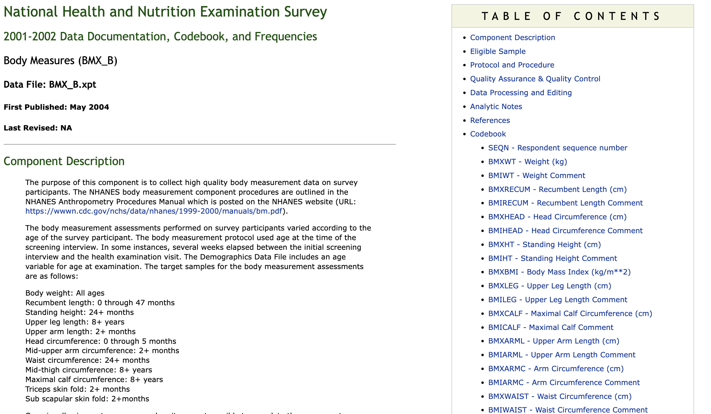
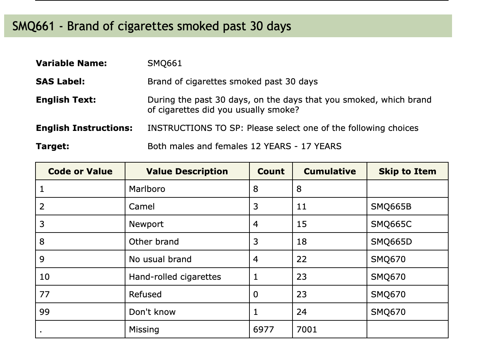

```{r, include = FALSE}
knitr::opts_chunk$set(
  collapse = TRUE,
  comment = "#>"
)

library(phonto)
library(kableExtra)
```


### Introduction

In this vignette we describe the NHANES metadata and give some examples of how it can be used to ensure that the variables and tables used in an analysis are measuring the same things, are reported in the same units, targeted the same demographics and a host of other challenges that might arise. We assume that the reader is using either a Docker container with a copy of the NHANES database, or that they have a locally available NHANES database.  These tools can be used with the `nhanesA` package but that will likely be slow and cumbersome. Details on the NHANES data etc are described in the `Quick Start` vignette and readers should be familiar with that document.

Within the container there are a few variables that are set and help users identify which version they are working with, and one variable the tells where the HTML documentation.
In the table below the first two values are in the `VersionInfo` table in the database.
`NHANES_TABLE_BASE` is an environment variable in the Linux OS being run.

Variable          | Value                    
---------------   | ------------------------ 
CONTAINER_VERSION | Version number for the Container        
COLLECTION_DATE   | Date data were downloaded 
NHANES_TABLE_BASE | Location of HTML documentation, environment variable

  
In this vignette we are interacting directly with the Postgres (or other backends). The first thing to do is to determine which version of the data you are working with. The next code chunk shows how to access that information.  When working directly with the database we use the `phonto` package which has established a connection, `phonto:::cn()`, which you should use.

```{r versionInfo}
VersionInfo <- dplyr::tbl(phonto:::cn(), I(nhanesA:::MetadataTable("VersionInfo")))
VersionInfo <- as.data.frame(VersionInfo)
VersionInfo
```

You can see what date the underlying data were collected on as well as what version of the Docker Container is being used.  This information should be included in any papers that are intended to be reproducible.

 
## NHANES Metadata

Within the database metadata are stored in their own schema. There are three tables that describe the NHANES data:

  * `QuestionnaireDescriptions` - one row per table, all information about the table, use constraints, download errors
  * `QuestionnaireVariables` - one row per variable gives the data from the HTML documentation, translation errors go here, excluded tables go here 
  * `VariableCodebook` - one row for each possible value for each variable; describes the coded values for all categorical variables.
  * `VersionInfo - provides version information and the date the data were downloaded

### The Metadata Schema

`QuestionnaireVariables`

This table has one row for each NHANES table/variable combination.  This table captures the information in the variables descriptions, similar to that in Figure S1. Additional information informs on the table name (DEMO_J for the table in Figure S1),  whether there are use constraints.  The IsPhenotype column is one we curate and it indicates whether the variable is a phenotype and could be used as a covariate or a response.  Variables such as individual identifier, SEQN, or the survey weights should not be used as variables in regression models, for example.


```{r QuestionnaireVariables, echo=TRUE}
zz = phonto:::metadata_var()
knitr::kable(colnames((zz)), caption="Variables in the Questionnaire Variables Table",
   col.names="Variables") |> kable_styling(latex_options = "HOLD_position")

```


The `VariableCodeBook` table has one row for each possible value for a variable. So,
for each table, and within that for each variable, there are multiple rows describing the values that variable can have. The column lables of the `VariableCodeBook` table are below.

```{r variablecodebook, echo=TRUE}
zz = phonto:::metadata_cb()
knitr::kable(colnames((zz)), caption="Variables in the Variable Codebook Table",
   col.names="Variables") |>
  kable_styling(latex_options = "HOLD_position")

```

And last we describe the `QuestionnaireDescriptions` table. It has one row for for each questionnaire or table.  The data include the year that the questionnaire was used, the data group (demographics, laboratory etc), whether there are use constraints on the data, the URLs used to obtain the data and the documentation and the release date. The release date can change if the data are modified by the CDC.

```{r QuestionnaireDescriptions, echo=TRUE}
zz = phonto:::metadata_tab()
knitr::kable(colnames((zz)), caption="Variables in the Questionnaire Descriptions Table",
   col.names="Variables") |> kable_styling(latex_options = "HOLD_position")

```


### HTML Data

The HTML manual pages provided by the CDC are all downloaded as part of our ETL process. They are placed on the file system of the Docker container with the same directory structure as the CDC uses.  This allows us to browse those files, using the same accessor functions in the `nhanesA` package by just changing the root of the file system.  As noted above we use an environment variable, `NHANES_TABLE_BASE`, to detect the presence of this local cache and then use it for browsing.  This ensures that the HTML being viewed is consistent with the data that is in the container.  As the CDC updates files, there will be discrepancies between the on-line HTML files and the data in the container.

Using the `browseNHANES` function within the container will access the local files whenever a file name is specified with the `nh_table` argument.  In the future we plan to enable natural language processing (NLP) on these files to enable augmentation of analysis work with new developments in AI.

### Example

We next provide some examples of the HTML pages and describe how the information reported in them is transformed into the metadata tables in the database.

{width=90%}

The BMX_B questionnaire provides data from the 2001-2002 cycle and is shown in Figure 1. The web page provides details on the measurements and how they are recorded.  These pages typically have a brief description, that outlines how the data were collected and gives suggestions on how they should be analyzed and interpreted. Limitations and changes from previous years are often provided.  Analysts are strongly encouraged to read these prior to doing any analyses.  On the right side there is a list of the variables that were collected. They are in the form of a short all-capitals label (typically the *SAS Label*) followed by a more descriptive title.


Below are examples of two of the variables, the first SEQN, is the sequence number, which provides a unique identifier for each individual within a cycle.  SEQN can be used to join data across tables within cycles. SEQN are not reused and there are no examples of individuals participating in more than one cycle.

{width=80%}

{width=80%}


```{r describeTables}

## Need to combine data from BPQ*, BPX*, and DEMO*
bpq_tables <- c("BPQ", "BPQ_B", "BPQ_C", "BPQ_D", "BPQ_E", "BPQ_F", "BPQ_G", "BPQ_H", "BPQ_I", "BPQ_J")
bpx_tables <- c("BPX", "BPX_B", "BPX_C", "BPX_D", "BPX_E", "BPX_F", "BPX_G", "BPX_H", "BPX_I", "BPX_J")
demo_tables <- c("DEMO", "DEMO_B", "DEMO_C", "DEMO_D", "DEMO_E", "DEMO_F", "DEMO_G", "DEMO_H", "DEMO_I", "DEMO_J")

bpxVars = c("BPXSY1", "BPXSY2", "BPXDI1", "BPXDI2")

demoVars = c("RIDRETH1", "RIDAGEYR",  "RIAGENDR", "DMDEDUC2")
bpqVars = c("BPQ020", "BPQ050")
```

There are accessor functions to obtain the metadata tables as R dataframes and these can subsequently be filtered, using `dplyr` or other tools to find the information.
```{r querymetadata}
QuestionnaireDescriptions <- metadata_tab()

QuestionnaireVariables <- metadata_var()

VariableCodeBook <- metadata_cb()

demoAtarget = dplyr::filter(QuestionnaireVariables, (TableName %in% demo_tables) & (Variable=="RIDAGEYR") )
dAt = dplyr::collect(demoAtarget)
ans1  = dplyr::pull(demoAtarget, "Target")

DemoAgeCodebooks = dplyr::filter(VariableCodeBook, (TableName %in% demo_tables) & (Variable=="RIDAGEYR"))
AgeCb = dplyr::collect(DemoAgeCodebooks)

sp1 = split(AgeCb, AgeCb$TableName)

library(stringr)
ptabs = dplyr::filter(QuestionnaireDescriptions, str_detect(TableName, "^P_") )
```


### 1. Quick check NHANES data

We can efficiently access NHANES data using `phonto` and `nhanesA` together. By simply knowing the name of the data file or table, one can very quickly and efficiently obtain basic information, e.g. column names, dimensions, etc. 

First we load up the packages we will use for this vignette.
```{r setup}
library(nhanesA)
library(phonto)
library(DT)
```

Let's take a body measure table as an example, (<tt>BMX_I</tt>).

- show column names of an NHANES table. 

```{r}
nhanesColnames("BMX_I")
```

- show number of rows/columns and dimension of an NHANES table
```{r}
nhanesNrow("BMX_I")
nhanesNcol("BMX_I")
nhanesDim("BMX_I")
```

- First/Last records of an NHANES table

```{r}
nhanesHead("BMX_I")
nhanesTail("BMX_I")
```


### 3 nhanesCodebook

Information about each variable is stored in the NHANES code book. To access the NHANES code book one can use the `nhanesCodebook` function. The function returns a list of length 5 that provides pertinent information about the variable. The first four elements provide basic descriptor information, i.e. `Variable` is the variable name, `Description` is the actual text of the question (or a description of the lab value), `Target` tells you which participants were eligible to be asked and `SasLabel` is the variable label.
The 5th element, the `Codebook`, is a data frame providing information about the structure of the variable, such as which values the variable can take on. When you want to combine variables across study years you will need to be careful to ensure that the `Codebooks` are compatible.  NHANES has changed variables, added or removed possible answers, and done many other things as the questionnaires have evolved.  It is **not safe** to assume that an identical variable name will have an identical interpretation.
 
```{r}
 LDLTabs = nhanesSearchVarName('LBDLDL')
 LDLTabs

  cb1 = nhanesCodebook(nh_table = LDLTabs[1], colname = "LBDLDL") 
  cb1
```

  The alert reader will have noticed the column labeled Cumulative.  The values in this column are provided by NHANES and can be used to check whether the data extraction you carried out aligns with their reported values.  The column labeled SkipToItem will be non-missing if there was some complex logic in how the survey was performed. In some cases a set of questions will be skipped for a subset of the participants, depending on their answer to the *current* question.  For example, if the current question was ``Have you ever been told by your doctor you have Diabetes?``, and then there say 10 follow-up questions asking about symptoms, someone who answered ``No`` would not want to answer those questions, and so the interviewer will skip over them, to the next relevant question for anyone who says ``No``. This makes for a good survey experience for the participants but it also makes the data analysis a bit messier.  The analyst will have to examine all the questions that can be skipped and assess how to deal with the values recorded.
  While we are on the subject of messy data, the `Target` information can also introduce structured missingness into your data. Some questions are only relevant to certain age groups, and in those cases the `Target` field will indicate who is going to be asked. Everyone outside of the `Target` range will have a missing value for that question.

## Data Consistency

Because NHANES is a multi-year (multi-cycle) survey it will be important to examine data consistency across cycles.   Most TableNames use the naming convention of basename with a suffix that can be missing or
that uses underscore followed by a capital letter in the range [B..J], ie 'TableName_X'.  In 2020 data collection was halted and data collection for the 2019-2020 cycle was incomplete.  The CDC has combined the collected data for the 2019-2020 cycle and labeled these tables using similiar prefix convention of 'P_TableName', was used. [We don't currently have these in the PostgresDB].

We treat the combination of TableName and VariableName as uniquely identifying a feature or phenotype. For example, we anticipate that user might like to analyze all systolic blood pressure measurements in the 'BPX' set of tables (eg `BPX, BPX_B, ...,BPX_J`) in a single analysis.  But in order to do this they need to verify that essentially the same phenotype was measured in each cycle.  Checking for consistency can be done using the metadata.  We will also suggest that there are two consistency issues that may need to be addressed. One is whether the phenotype is consistently measured and a second is whether or not there is drift in targeting or other aspects of the data collection process.

### Phenotype Consistency

Here we are mainly focused on looking at the CodeBooks and trying to assess whether the information in them has been collected consistently across different cycles.  For this purpose the `qc_var` function can be quite helpful.  We use the LDL example from above, where the LBDLDL variable reports LDL cholesterol levels in mg/dL.  We can see that there are issues with this variable.  The targeting is not consistent, sometimes the target is 12-150 year olds, and sometimes it is 3-150.  Also, the SAS Label and English text seem to have changed at some point and the measurements might not be the same across all tables.

```{r qcvarex}
 LBDLDLqc = qc_var("LBDLDL")
 LBDLDLqc
```

For the `unionQuery` function we typically should do some checking of phenotype consistency before we call it.

```{r unionQueryCheck}
cols = list(DEMO_F=c("RIDAGEYR","RIAGENDR","RIDRETH1","DMDEDUC3"),
                     DEMO_G=c("RIDAGEYR","RIAGENDR","RIDRETH1","DMDEDUC3"))
dd = unionQuery(cols)
                   
```
### Missing Values

Missing values are prevelant in survey data collection.  There are many reasons for values to be missing and in general any analysis should consider how missing values should be handled. Some arise because the respondent doesn't know the answer, sometimes they don't want to respond to very personal questions, or questions about practices that carry social stigmas.  

There are other cases where the missingness is structural. Questions about menopause will be not be surfaced to men, or questions about prostate cancer are not surfaced to women.

Handling missing data is often important since many methods for analyzing the data don't allow for missing data.  In those cases the analyst is typically left with few choices.  They can exclude all cases with missing values or they can impute (or multiply impute) missing values.

Handling missing data appropriately requires understanding why the data is missing and in some cases substituting a value, when its value can reasonably be identified.  For example, if first we ask "Do you smoke cigarettes?", and next ask "How many cigarettes do you smoke each day?"
then in many survey deployments anyone answering *No* to the first question will not be asked the second one.  But if we believe the answer to the first question, then the answer to the second question would be zero.

### Practicalities of Survey Deployment

Readers familiar with the practice of giving surveys know that this is a complex process. The survey often has questions and components that are conditional on specific answers. For example, there are diseases such as prostate cancer or ovarian cancer that are only relevant to part of the population.  We might ask if someone has a condition and follow that with questions about symptoms or treatments.  The survey experience is better for the participants, and they stay engaged, when only appropriate and pertinent questions are surfaced.  And so most surveys and systems for giving surveys have mechanisms for *skipping* over questions and answers.

This practice introduces a complexity in the data and its analysis. One of challenges is that a system to help identify individuals who were not asked the question so that they could be separated from any other respondent who was asked the question and did not provide an answer. Those two types of missingness are different and they will most likely need to be treated differently in the analysis.

Fortunately in the NHANES data the metadata available identifies which questions can trigger, or cause, skipping.  We have created some tools to help identify which questions were likely skipped. In the image below we see some of the complexities.  Depending on what brand of cigarette the person usually smokes they skip to different questions to find out about the actual products that are being consumed.

{width=80%}

In the code chunk below we extract the smoking data, and then try to create the groupings
used in the paper.  They have three groups, non-smokers, current smokers and ex-smokers. We use the `SMQ_I` table. We will define non-smoker as someone who as never smoked more than 100 cigarettes (`SMQ020`), anyone who has smoked more will be either
a current smoker or an ex-smoker (`SMQ040`).  But anyone who has not smoked that many cigarettes will have a missing values for the variable `SMQ040`.

In the code below we first get all the skipping information.  The function `get_skip_info` parses the metadata and extracts the information about skipping.  It summarizes the information in a dataframe with columns that identify the `Table`, the `Variable` and then if it might be skipped, and when it might be skipped which previous questions might have caused the skipping.

Here we see that `SMQ040` can be skipped and that the answer to `SMQ020` is the only question that could cause that.  While for `SMDUPCA` three are many different places where skipping of this question could be triggered.

```{r skip1}
smqSkip = get_skip_info("SMQ_I")
smqSkip[smqSkip$Variable=="SMQ040",]
smqSkip[smqSkip$Variable=="SMDUPCA",]
```

### PHESANT-like process

The NHANES project provides thousands of phenotypes and exposures. Navigating these can be very challenging and we are in the process of developing tools that will aid users in navigating the data quickly and reliably. Developing tools that can better help analysts navigate data at this scale is important.  We are patterning our efforts on those that were developed for the UK Biobank (Bycroft et al. 2018) and specifically the PHESANT (Millard et al. 2017) package.  

We can run a PHESANT-like process to convert each column into data types. It also provides the ratio of unique values (`r_unique`), the proportion of zeros (`r_zeros`), and the ratio of NAs (`r_NAs`), which is calculated by the number of unique values, zeros, and NAs divided by total records. The categorical data types (ordered or unordered) are represented by integers, and we categorize them as multilevel. For example, education (DMDEDUC2) is labeled as Multilevel(7) which means it has 7 levels. Information on whether or not the levels are ordered would have to be obtain from the on-line NHANES documentation.

```{r}
cols = list(DEMO_I=c("RIDAGEYR","RIAGENDR","RIDRETH1","DMDEDUC2"),
                     DEMO_J=c("RIDAGEYR","RIAGENDR","RIDRETH1","DMDEDUC2"),
                     BPQ_I=c('BPQ050A','BPQ020'),BPQ_J=c('BPQ050A','BPQ020'),
                     HDL_I=c("LBDHDD"),HDL_J=c("LBDHDD"), TRIGLY_I=c("LBXTR","LBDLDL"),
            TRIGLY_J=c("LBXTR","LBDLDL"))
data <- jointQuery(cols)
tdata = data[1:100,]
datatable(tdata)
```


```{r}
phs_dat = phesant(data)
data = phs_dat$data
DT::datatable(phs_dat$phs_res)
```

We can also find out which variables are categorical.
```{r CategoricalVars, echo=TRUE}
categoricalVars = rownames(phs_dat$phs_res)[grep("^Multilevel", phs_dat$phs_res$types)]
categoricalVars
```


### 6.Setup factor levels for categorical variables

In the raw NHANES data stored in the database all categorical variables are represented as integers.  In order to make use of these for analysis you will need to transform them into factors in R.  

Categorical variables are presented with integers as shown below.

```{r}
data[,c('RIAGENDR', 'RIDRETH1','DMDEDUC2')] |> head() |> knitr::kable()
```
And the real factor levels for year 2003-2004 can be found in [the codebook]() as shown below.
{width=85%}
{width=85%}
{width=85%}


The data from NHANES comes as tables with integer codes for each of the levels of a factor variable.  A separate file, one for each cycle and questionnaire, has the map from the codes to the text description of what the levels mean. Because the chances of errors if users have untranslated variables (e.g. treating them as integers for example) we automatically translate all of these tables.  There is a way to access the raw data that is explained in a different vignette.


Currently, we are using the following flow chart. Both ordered and unordered categorical variables are considered as multilevel.

{width=80%}

